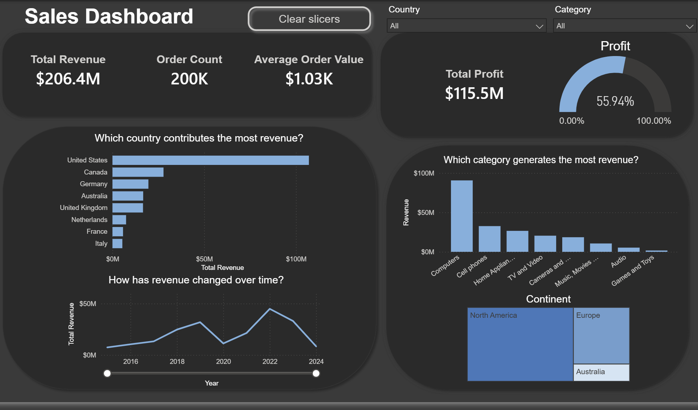

# Sales Analytics Dashboard | Power BI

An interactive Power BI dashboard designed to monitor sales performance, customer behavior, and business profitability for an e-commerce business. The dashboard provides executives and analysts with an intuitive interface to explore key metrics, identify trends, and support data-driven decision-making.

---

# Dashboard Demo

---

# Dashboard Pages

## Sales Overview

The **Sales Overview** page provides a high-level summary of business performance through executive KPIs and interactive visualizations.

### Key Metrics

- Total Revenue
- Total Profit
- Order Count
- Average Order Value (AOV)

### Visualizations

- Revenue by Country
- Revenue by Product Category
- Revenue Trend Over Time
- Revenue Distribution by Continent
- Profit Performance

### Business Value

This page enables stakeholders to:

- Monitor overall business performance
- Identify top-performing regions and product categories
- Track revenue trends over time
- Evaluate profitability at a glance

---

## Customer Value Analysis

The **Customer Value Analysis** page focuses on customer purchasing behavior and revenue contribution across different customer groups.

### Key Metrics

- Average Customer Lifetime Value (LTV)
- Average Purchase Frequency

### Visualizations

- Customer Segmentation
- Revenue by Customer Segment
- Revenue by Occupation
- Revenue by Gender
- Revenue Across Age Groups

### Business Value

This page helps businesses:

- Identify high-value customers
- Understand customer demographics
- Compare purchasing behavior across segments
- Support targeted marketing strategies

---

# Dashboard Features

The report includes several interactive features to enhance user exploration:

- Interactive slicers
- Cross-filtering between visuals
- Dynamic KPI updates
- Executive summary cards
- Responsive report navigation
- Clean dark-themed dashboard design

---

# Dashboard Highlights

### Sales Performance

- Track revenue and profit using executive KPIs.
- Monitor sales trends over time.
- Compare sales across countries and product categories.

### Customer Analytics

- Analyze customer lifetime value.
- Evaluate customer purchasing frequency.
- Explore revenue distribution across customer demographics.

---

# Skills Demonstrated

### Power BI

- Dashboard Design
- Data Modeling
- Report Navigation
- Interactive Reporting
- Data Storytelling

### DAX

- Measures
- KPI Calculations
- Business Metrics
- Aggregations

### Power Query

- Data Transformation
- Data Cleaning
- Data Preparation

### Data Visualization

- KPI Cards
- Line Charts
- Clustered Bar Charts
- Clustered Column Charts
- Pie Charts
- Treemaps
- Waterfall Charts
- Interactive Slicers

---

# Technologies Used

- Power BI Desktop
- DAX
- Power Query

---

# Conclusion

This dashboard demonstrates how Power BI can transform analytical data into an interactive business intelligence solution. By combining executive KPIs, customer analytics, and intuitive visualizations, the report enables users to quickly assess business performance, uncover trends, and support strategic decision-making.