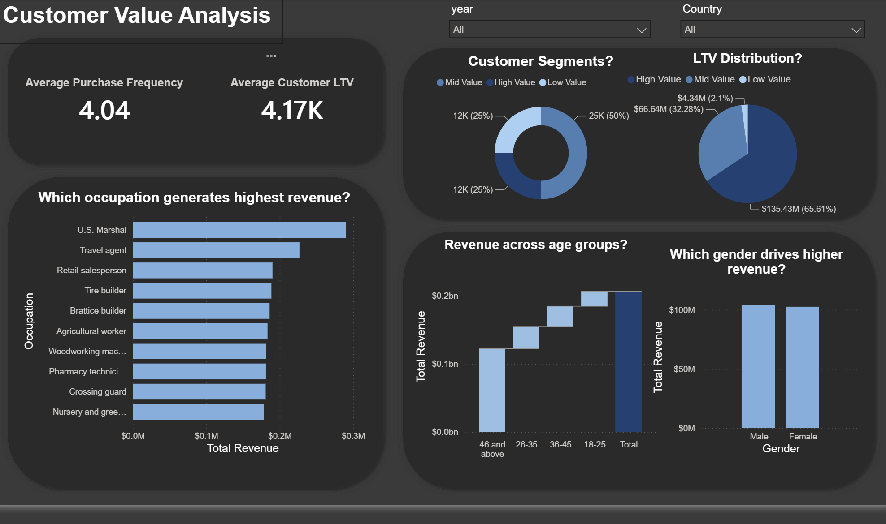

# 🛒 E-Commerce Sales Analysis 

An end-to-end business intelligence project that analyzes e-commerce sales data using **PostgreSQL** for advanced analytics and **Power BI** for interactive business reporting.

The project explores customer purchasing behavior, revenue performance, customer lifetime value (LTV), cohort trends, and customer retention to generate actionable business insights.

---

# Dashboard Demo

---

# Dashboard Preview

## 📈 Sales Overview

---

## 👥 Customer Value Analysis

---
## Project Pipeline

| Phase | Deliverable |
|--------|-------------|
|  Data Preparation | Cleaned and transformed transactional sales data using SQL |
|  Business Analysis | Customer Segmentation, Cohort Analysis, and Retention Analysis |
|  Dashboard Development | Interactive Power BI dashboard with KPIs and visual analytics |
|  Business Insights | Actionable recommendations based on customer and sales behavior |
---

# SQL Analysis

The SQL module prepares and analyzes the dataset using analytical queries to uncover customer behavior and sales trends.

**Topics Covered**

- Data Preparation
- Customer Segmentation
- Cohort Analysis
- Customer Retention Analysis

📖 **Documentation**

➡️ [SQL Analysis README](SQL_Analysis/README.md)

---

## Power BI Dashboard

The Power BI report transforms SQL outputs into an interactive dashboard for business reporting and performance monitoring.

**Dashboard Pages**

- Sales Overview
- Customer Value Analysis

📖 **Documentation**

➡️ [Power BI Dashboard README](Power_BI_Dashboard/README.md)

---

# Tech Stack

| Category | Technology |
|-----------|------------|
| Database | PostgreSQL |
| Query Language | SQL |
| Business Intelligence | Power BI |
| Data Modeling | DAX |
| Data Transformation | Power Query |

---

# Key Insights

- High-value customers generate approximately **66%** of total revenue.
- Older customer cohorts consistently outperform newer cohorts in revenue generation.
- Customer retention remains low across acquisition cohorts, highlighting opportunities for retention strategies.
- Revenue is concentrated within a limited number of countries and product categories.
- Interactive dashboards enable stakeholders to explore sales performance and customer behavior efficiently.

---

# Conclusion

This project demonstrates a complete analytics workflow by combining SQL for data analysis with Power BI for interactive reporting. It showcases practical business intelligence techniques used to transform raw sales data into meaningful insights that support strategic decision-making.