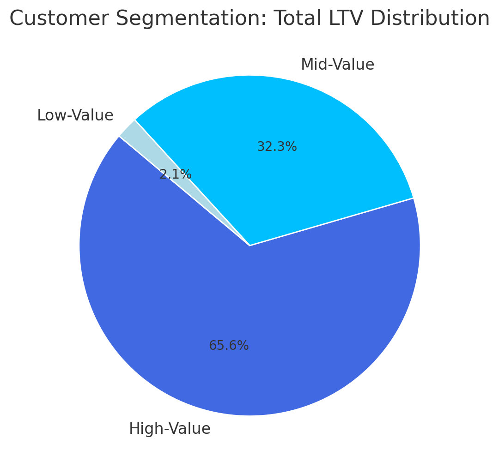
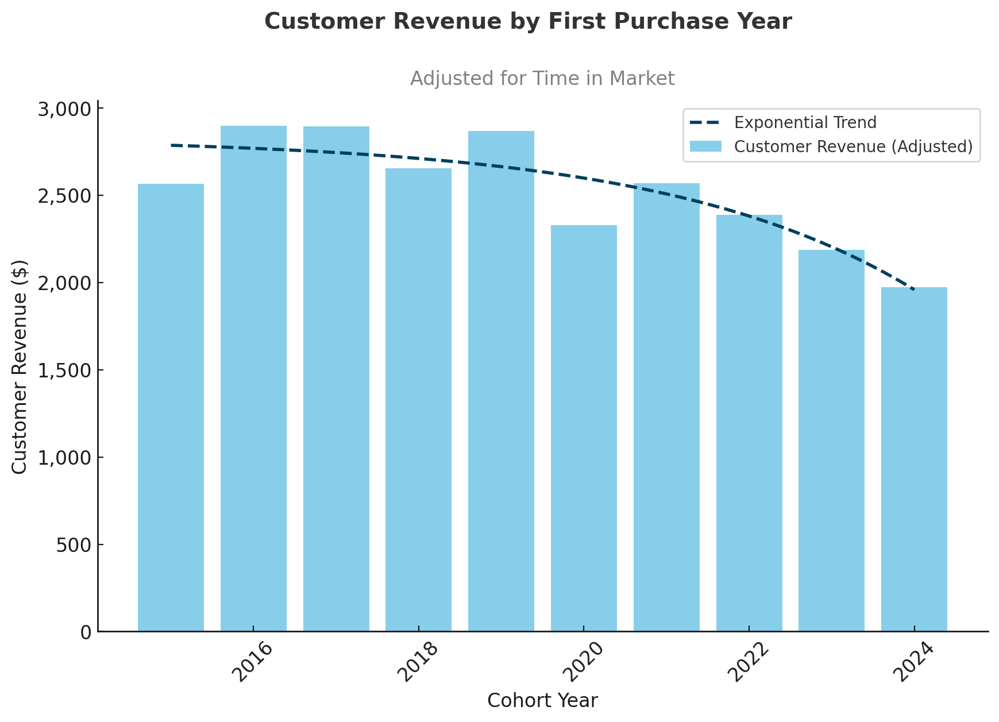
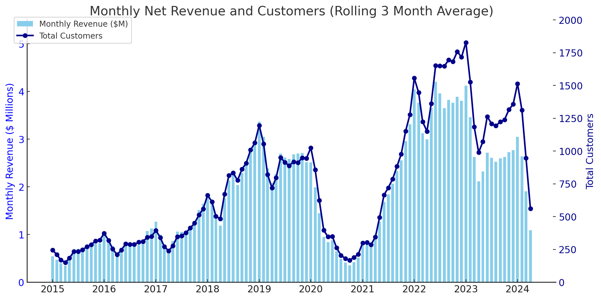
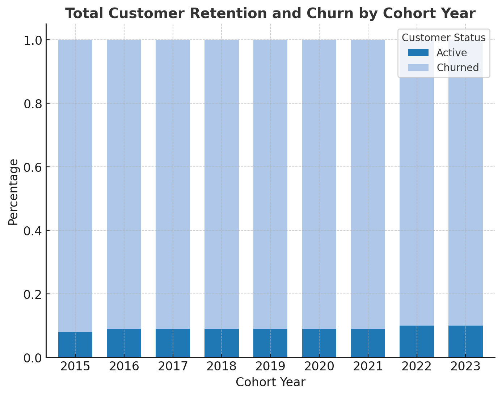

# Customer Sales Analysis Using SQL

## Overview

This project analyzes customer purchasing behavior using SQL to identify high-value customers, evaluate revenue trends across acquisition cohorts, and measure customer retention. The analysis provides business insights that support data-driven decisions for customer engagement, revenue growth, and churn reduction.

---

## Project Objective

The primary objectives of this project are to:

- Segment customers based on Lifetime Value (LTV)
- Analyze revenue generation across customer cohorts
- Measure customer retention and churn trends
- Generate actionable business recommendations using SQL

---

## Business Questions

This project answers the following business questions:

1. Which customers generate the highest lifetime value?
2. How do customer cohorts contribute to revenue over time?
3. Which customers are at risk of churning?
4. How effective is customer retention across acquisition cohorts?

---

## Dataset

The analysis uses sales transaction data combined with customer information.

### Sales Data
- Customer ID
- Order Date
- Quantity
- Net Sales
- Exchange Rate

### Customer Data
- Customer ID
- Customer Name
- Country
- Age

---

# Project Structure

```
.
├── 0_create_view.sql
├── 1_Customer_Segmentation.sql
├── 2_Cohort_Analysis.sql
├── 3_Retention_Analysis.sql
├── Images
└── README.md
```

---

# Analysis

## 1. Data Preparation

**SQL File:** [0_create_view.sql](SQL_Queries/0_create_view.sql)


Created a reusable analytical view by:

- Combining customer and sales data
- Calculating customer revenue
- Identifying each customer's first purchase date
- Preparing data for cohort and retention analysis

---

## 2. Customer Segmentation

**SQL File:** [1_Customer_Segmentation.sql](SQL_Queries/1_Customer_Segmentation.sql)


Customers were segmented according to their Lifetime Value (LTV) using percentile-based thresholds.

### Analysis Performed

- Calculated total customer lifetime revenue
- Classified customers into:
  - High Value
  - Mid Value
  - Low Value
- Measured customer count and revenue contribution by segment

### Visualization



### Key Findings

- High-value customers represent **25%** of customers while generating **66%** of total revenue.
- Mid-value customers contribute **32%** of revenue.
- Low-value customers account for only **2%** of overall revenue.

### Business Recommendations

- Develop VIP loyalty programs for high-value customers.
- Encourage mid-value customers to increase spending through personalized promotions.
- Launch re-engagement campaigns targeting low-value customers.

---

## 3. Cohort Analysis

**SQL File:** [2_Cohort_Analysis.sql](SQL_Queries/2_Cohort_Analysis.sql)

Customer cohorts were grouped based on the year of their first purchase to evaluate long-term revenue performance.

### Analysis Performed

- Revenue by acquisition cohort
- Revenue per customer
- Monthly customer and revenue trends
- Rolling average revenue analysis

### Visualizations

**Revenue by Customer Cohort**



**Monthly Revenue & Customer Trends**



### Key Findings

- Older cohorts consistently generated higher average revenue than recent cohorts.
- Revenue and customer acquisition peaked during 2022–2023.
- Recent cohorts show declining revenue per customer.

### Business Recommendations

- Improve engagement strategies for newer customers.
- Introduce loyalty programs to increase repeat purchases.
- Replicate successful acquisition strategies from high-performing cohorts.

---

## 4. Customer Retention Analysis

**SQL File:** [3_Retention_Analysis.sql](SQL_Queries/3_Retention_Analysis.sql)

Measured customer retention by identifying inactive customers based on purchase history.

### Analysis Performed

- Identified active and churned customers
- Calculated cohort retention rates
- Measured customer inactivity over time

### Visualization



### Key Findings

- Retention stabilizes around **8–10%** after several years.
- Approximately **90%** of customers eventually churn.
- Recent cohorts follow similar churn patterns as earlier cohorts.

### Business Recommendations

- Focus retention efforts during the first two years.
- Implement personalized win-back campaigns.
- Monitor customer activity to identify churn risk earlier.

---

#  Skills Demonstrated

- Views
- Common Table Expressions (CTEs)
- Window Functions
- Aggregate Functions
- CASE Expressions
- Percentile Calculations
- Date Functions
- Cohort Analysis
- Customer Lifetime Value (LTV)
- Customer Retention Analysis

---

# Strategic Recommendations

### Customer Segmentation

- Build loyalty programs for high-value customers.
- Increase average order value for mid-value customers.
- Re-engage low-value customers through targeted campaigns.

### Revenue Growth

- Improve retention among newer customer cohorts.
- Increase repeat purchases through personalized marketing.
- Optimize customer acquisition strategies using historical cohort performance.

### Customer Retention

- Strengthen onboarding experiences.
- Monitor early warning indicators for churn.
- Implement proactive customer engagement strategies.

---

# Technologies Used

- PostgreSQL
- DBeaver
- SQL

---

# Conclusion

This project demonstrates how SQL can be used to transform raw transactional data into meaningful business insights. Through customer segmentation, cohort analysis, and retention analysis, the project identifies revenue opportunities, customer behavior patterns, and actionable strategies to improve long-term business performance.